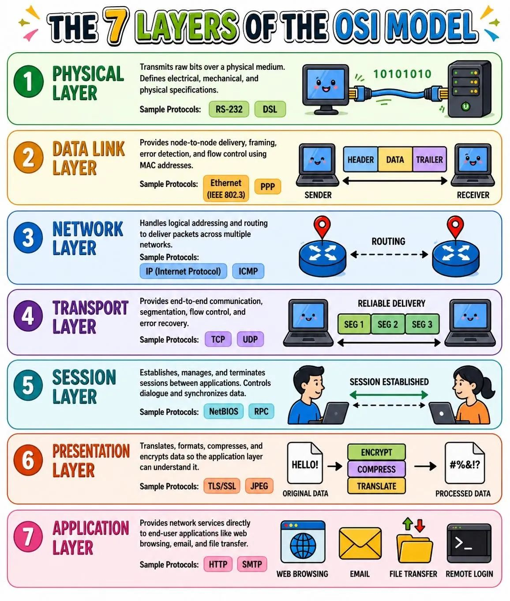

## ¿Los puertos forman parte de la capa de red?

El Modelo OSI es un modelo conceptual de cómo funciona Internet. Divide los diferentes servicios y procesos de Internet en 7 capas. Estas capas son:

Los puertos son un concepto de la **capa de transporte (capa 4)**. Solo un protocolo de transporte como el Protocolo de control de transmisión (TCP) o el Protocolo de datagrama de usuarios (UDP) puede indicar a qué puerto debe ir un paquete. Las cabeceras de TCP y UDP tienen una sección para indicar los números de puerto. Los protocolos de la capa de red, por ejemplo, el Protocolo de Internet (IP), no saben qué puerto está en uso en una determinada conexión de red. En una cabecera de IP estándar, no hay lugar para indicar a qué puerto debe ir el paquete de datos. Las cabeceras de IP solo indican la dirección IP de destino, no el número de puerto en esa dirección IP.

Normalmente, la imposibilidad de indicar el puerto en la capa de red no tiene impacto en los procesos de red, ya que los protocolos de **la capa de red casi siempre se utilizan junto con un protocolo de la capa de transporte**. Sin embargo, esto repercute en la funcionalidad del software de pruebas, que es el software que "comprueba la disponibilidad" de las direcciones IP de usando paquetes del [Protocolo de control de mensajes de Internet (ICMP)](https://www.cloudflare.com/learning/ddos/glossary/internet-control-message-protocol-icmp/). El ICMP es un protocolo de capa de red que puede diagnosticar la disponibilidad de los dispositivos conectados a la red, pero sin la posibilidad de hacerlo para puertos concretos, los administradores de la red no pueden probar servicios específicos en esos dispositivos.

Algunos programas de diagnóstico de red, como [My Traceroute](https://www.cloudflare.com/learning/network-layer/what-is-mtr/), ofrecen la opción de enviar paquetes de UDP. El UDP es un protocolo de capa de transporte que puede especificar un puerto concreto, a diferencia del ICMP, que no puede especificar un puerto. Al añadir una cabecera de UDP a los paquetes ICMP, los administradores de la red pueden probar puertos específicos en un dispositivo en red.