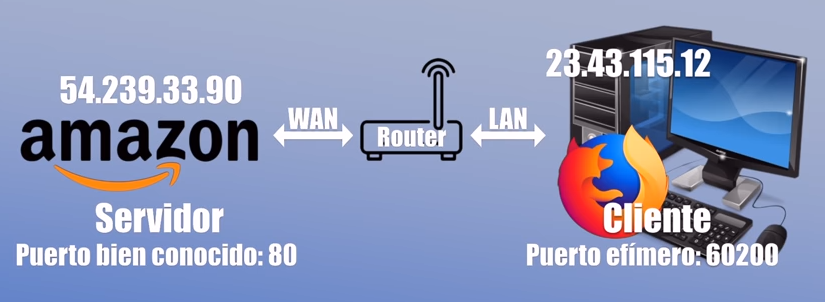

## ¿Qué son los puertos?

Antes de saber qué tipos de puertos hay y para qué se utiliza cada uno, es aconsejable tener bien claro qué son los puertos.

Para que se entienda de manera sencilla, un puerto se refiere a un punto de conexión final, como un router, que se utiliza para dirigir el tráfico de red entrante y saliente.

> Un **puerto de conexión de red** es un número lógico que sirve para **identificar un servicio o aplicación concreta** dentro de un dispositivo conectado a una red (como un ordenador, servidor o router).

Cada puerto, está asociado virtualmente a un número y estos números, a su vez se dividen en diferentes categorías. La asignación de estos números es muy importante para garantizar una conexión ordenada y eficiente entre los diferentes dispositivos de la red.

Funciona junto con la dirección IP:

- **IP** → identifica el dispositivo
- **Puerto** → identifica el servicio dentro del dispositivo

#### Cómo funciona

Cuando un equipo envía datos por la red:

1. Se indica la dirección IP del destinatario.
2. Se añade un número de puerto para especificar qué aplicación debe recibir esos datos.

Si pensamos en un router, los puertos se utilizan para direccionar el tráfico de manera específica a aplicaciones concretas y servicios específicos. Por ejemplo, cuando envías una solicitud a un servidor web, el router recibe la solicitud en un puerto específico, **como el 80 para HTTP o el 443 para HTTPS**. Luego, el router redirige la solicitud al dispositivo correcto en la red interna donde estás conectado.

Además, cada puerto, tiene su propia función y dará mejores resultados para según qué servicio. Para el correo electrónico, por ejemplo, se utiliza el puerto 25. Por otro lado, los puertos privados permiten la comunicación interna dentro de la propia red sin que haya interferencias externas que puedan interrumpir la comunicación.

Al igual que también hay muchos puertos virtuales. Se pueden encontrar con números de puerto que van del 0 al 65535. Y es que los protocolos de Internet TCP y UDP deciden a qué proceso se envía el paquete de datos. Hay que tener en cuenta que esto se basa en un esquema servidor cliente.

## Video explicativo
Veamos una explicación más detallada en video:

<iframe style="width:80%; aspect-ratio:16/9;border:0;" src="https://www.youtube.com/embed/hmGmeGDRUAU" title="Tipos de puertos: bien conocidos, asignados y efímeros. Curso de redes desde 0 | Cap 6 |" allow="accelerometer; autoplay; clipboard-write; encrypted-media; gyroscope; picture-in-picture; web-share" referrerpolicy="strict-origin-when-cross-origin" allowfullscreen></iframe>