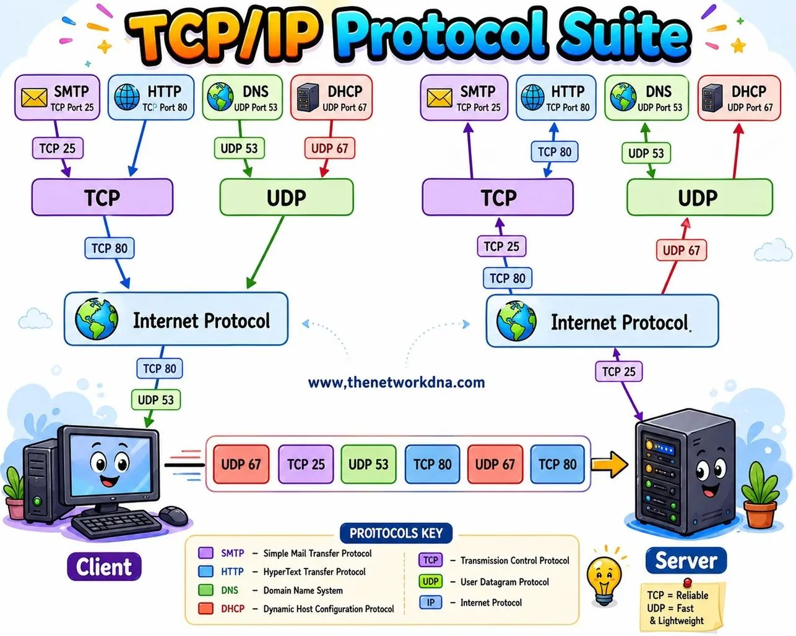
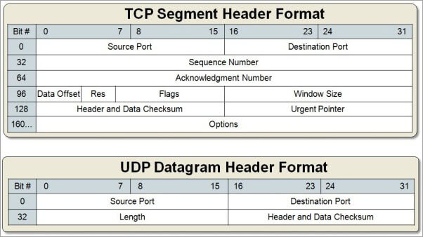

## ¿Qué es un puerto TCP/UDP?

Un puerto TCP/UDP es un **número de 16 bits** (un valor entre **0 y 65535**) **que se utiliza para identificar un punto final** (o **socket**) en una comunicación de red en un sistema informático. Estos puertos se utilizan en conjunto con el Protocolo de Control de Transmisión (TCP) y el Protocolo de Datagramas de Usuario (UDP), dos de los protocolos de comunicación más comunes en Internet.

La combinación de una **dirección IP** y un **número de puerto** TCP o UDP se denomina habitualmente **SOCKET** y se utiliza para dirigir el tráfico de red al servicio o aplicación correcta en un dispositivo o servidor. Cada número de puerto generalmente se asocia con un servicio específico o una aplicación en el sistema. Por ejemplo:

- El puerto 80 se asocia comúnmente con el tráfico web HTTP.
- El puerto 25 se usa para el correo electrónico saliente (SMTP).
- El puerto 53 se utiliza para las solicitudes de resolución de nombres de dominio (DNS).
- El puerto 22 se asocia con el protocolo SSH para la administración segura de sistemas.

**TCP (Protocolo de Control de Transmisión)** y **UDP (Protocolo de Datagramas de Usuario)** son dos de los protocolos de transporte más utilizados en Internet. TCP es un protocolo orientado a la conexión que garantiza la entrega de datos en el orden correcto y maneja la retransmisión de datos en caso de pérdida o error, es decir, controla y verifica que los datos lleguen al destinatario. UDP, por otro lado, es un protocolo sin conexión que no garantiza la entrega de datos ni el orden, pero es más rápido y eficiente para aplicaciones que no requieren una comunicación fiable, como la transmisión de video en tiempo real o juegos en línea.

## ¿Cómo hacen los puertos que las conexiones de red sean más eficientes?

Por una misma conexión de red fluyen tipos de datos muy diferentes hacia y desde un ordenador. El uso de puertos ayuda a los ordenadores a saber qué hacer con los datos que reciben.

Supongamos que Bob transfiere una grabación de audio en MP3 a Alice mediante el Protocolo de transferencia de archivos (FTP). Si el ordenador de Alice pasara los datos del archivo MP3 a la aplicación de correo electrónico de Alice, esta no sabría cómo interpretarlos. Pero ya que la transferencia de archivos de Bob utiliza el puerto designado para FTP (puerto 21), el ordenador de Alice es capaz de recibir y almacenar el archivo.

Entretanto, el ordenador de Alice puede cargar de forma simultánea páginas web HTTP utilizando el puerto 80, aunque tanto los archivos de la página web como el archivo de sonido MP3 circulan hacia el ordenador de Alice a través de la misma conexión WiFi.