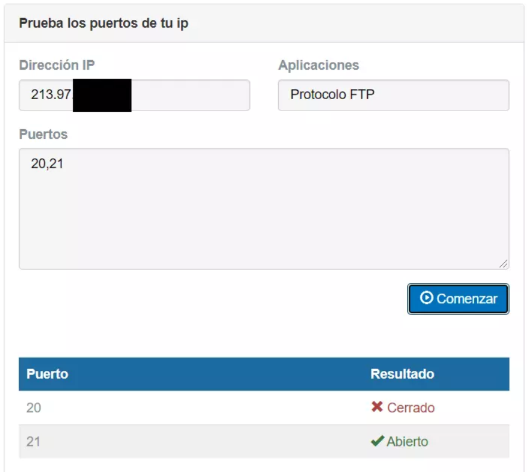
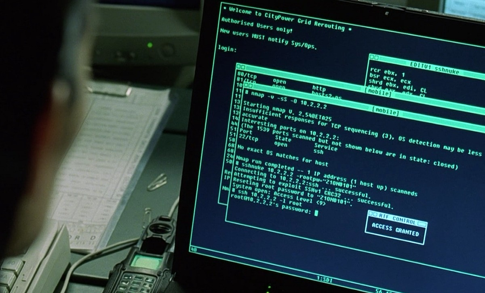

## Peligros de los puertos abiertos

Los puertos UDP se utilizan de forma constante para enviar y recibir paquetes y mensajes del exterior, y a su vez transmitir respuestas adecuadas. Por lo cual deben estar totalmente supervisados para evitar que algún ataque se pueda colar por ellos. **Cuando estos están abiertos estamos dejando puertas abiertas a nuestros dispositivos, lo cual puede ser tan positivo como negativo**, ya que muchas veces suelen utilizarse para lanzar ataques.

El malware, los troyanos y los accesos no autorizados, son algunos de los principales problemas con los que nos podemos encontrar, ya que se aprovechan de los puertos abiertos para poder acceder a nuestra red y ejecutar servicios que no están autorizados en los puertos. Para poder solucionar esto, lo mejor es **realizar análisis periódicos y monitorizar constantemente la comunicación de todos los servicios que se están ejecutando en esos puertos**.

Hoy en día, existen programas que son capaces de realizar escaneos de los puertos abiertos, y de esta forma obtener un listado para conocer por cuales de estos se puede lanzar un ataque. Los principales motivos de estos hacia las empresas, son el descubrimiento de secretos, los cuales se pueden filtrar ocasionando las correspondientes pérdidas económicas. La denegación de servicio (DDoS) es otro de los grandes problemas que nos pueden afectar, pues cuando los puertos facilitan la transferencia de datos a cualquier entidad, se pueden ejecutar ataques masivos en forma de accesos, los cuales pueden saturar la red ocasionando cuellos de botella. Por lo cual nuestro servicio se quedaría inaccesible.

Por lo cual es muy importante contar con las medidas de seguridad adecuadas y la capacidad de administración óptima para que la apertura de puertos no suponga un problema. Para ellos es recomendable generar procesos automáticos que realicen análisis de los puertos abiertos, en lugar de hacerlo de forma manual, lo que da más probabilidad de fallo. Tal y como habéis podido ver, es muy importante también proteger correctamente los puertos UDP, ya que son un vector muy importante y utilizado por ciberdelincuentes para violar la seguridad de nuestra red.

Es importante siempre que mantengamos los equipos protegidos, que estén actualizados y cuidemos los puertos que tenemos abiertos o expuestos en la red. La seguridad informática es muy importante y entran en juego muchos factores clave.


### Cómo comprobar los puertos UDP que tienes abiertos desde Internet

Para comprobar los puertos UDP abiertos, la forma más fácil, es entrando en una web específica usando nuestro navegador de Internet habitual. En este caso recomendamos hacer este [test de puertos](https://www.testdevelocidad.es/test-de-puertos/). En el caso de acceder desde el exterior (fuera de nuestra red local), conviene que apuntemos antes nuestra IP pública usando la web [cual es mi ip](https://www.cual-es-mi-ip.net/).

Una vez que hayamos entrado al test de puertos, lo primero que hay que hacer es poner nuestra dirección IP pública si accedemos desde el exterior. Luego añadimos el puerto o los puertos que queremos comprobar. Esta herramienta permite comprobar rangos de puertos y también usar puertos separados por comas. En esta ocasión hemos elegido el protocolo FTP y, a continuación, hemos pulsado en comenzar.



La información revela que tenemos el puerto 21 abierto. Esto significa que, por ejemplo, podríamos tener un servidor FTP generalmente utilizado para compartir archivos con el exterior. Sin embargo, si no tenemos uno, lo mejor que podemos hacer es cerrarlo. Así evitamos un posible ataque usando ese puerto.

 
### Cómo comprobar los puertos que tienes abiertos desde LAN

Si estás en la red local y los puertos no están abiertos de cara a la WAN de Internet, aunque no puedan ser accesibles desde el exterior, sí se podrían explotar vulnerabilidades desde la propia red local profesional. Uno de los programas más populares para realizar escaneos de puertos es [Nmap](https://nmap.org/zenmap/), el escaneo con el protocolo UDP se activa con la opción `-sU`, y si queremos realizar el escaneo con UDP y TCP a la vez, podemos añadir `-sS` también para verificar ambos protocolos simultáneamente. Simplemente con ejecutar el siguiente comando, estaremos escaneando todos los puertos UDP de un determinado host:

`nmap -sU -v <direccion ip>`
 

Dependiendo de lo que reciba Nmap, detectará si el puerto está abierto (hay contestación), si está abierto y filtrado (no se recibe respuesta), si está cerrado (si devuelve un error ICMP tipo 3 port unreachable) o filtrado (si recibe otro tipo de error ICMP).

```
Starting Nmap ( http://nmap.org )
Nmap scan report for 192.168.1.1
(The 997 ports scanned but not shown below are in state: closed)
PORT STATE SERVICE
53/udp open|filtered domain
67/udp open|filtered dhcpserver
111/udp open|filtered rpcbi
MAC Address: 00:01:02:03:04:05 (RedesZone Router)
```


## Problemas con CG-NAT

La CG-NAT es una tecnología que las operadoras de Internet utilizan para **compartir una sola dirección IP pública entre varios clientes**. Aunque el uso de la CG-NAT es eficiente con la gestión de direcciones IP y ayuda con la escasez de direcciones IPv4, puede darnos algunos problemas cuando intentamos abrir puerto en nuestra red.

El problema es, que bajo una CG-NAT, varios usuarios comparten la misma dirección IP. Cuando intentas abrir un puerto en tu router para permitir el acceso a un servicio en la red, la dirección IP compartida se convierte en un obstáculo. Como muchos usuarios comparten la misma dirección IP, el router de la CG-NAT, no puede saber a qué dispositivo debe dirigir la conexión.

Para solucionar estos problemas, algunas compañías de telecomunicaciones ofrecen servicios de IPv6 o planes de dirección IP pública estática. Si quieres solucionarlo, ponte en contacto con tu operadora de servicios para averiguar si te encuentras en la CG-NAT y te den alternativas para salir de ella.

 
## ¿Cómo debo proteger los puertos correctamente?

De manera predeterminada todos los puertos deberían estar cerrados, a no ser que estés utilizando un determinado servicio y lo tengas que abrir. **Es muy importante tener siempre el menor número de servicios locales expuestos**, ya que la superficie de ataque será menor. Los firewall nos van a permitir cerrar todos los puertos de forma automática, y abrir únicamente los que nosotros necesitemos.

**El software utilizado que abre un socket TCP o UDP es fundamental que esté actualizado**, de poco sirve tener todos los puertos cerrados excepto uno, si el servicio que hay corriendo en ese puerto está sin actualizar y tiene fallos de seguridad. Por este motivo, es tan importante la actualización de todo el software, es recomendable siempre utilizar software que se siga manteniendo, para recibir las diferentes actualizaciones.

Si para acceder a un determinado servicio se necesita autenticación, es necesario que las credenciales sean robustas, a ser posible, usad certificados digitales o claves SSH (si vas a autenticarte en un servidor SSH). Por ejemplo, siempre es recomendable cerrar el puerto 23 del Telnet, porque es un protocolo no seguro, y por tanto, es mejor no utilizarlo bajo ninguna circunstancia.


Es muy recomendable supervisar qué puertos TCP y UDP están en uso, para detectar posibles problemas de intrusiones o infección por troyanos. Es importante investigar cualquier tráfico extraño, o puertos que están abiertos cuando no deberían estarlo. Es también muy importante saber cómo se comporta un determinado servicio (que está escuchando en un determinado puerto) con un uso normal, para poder identificar el comportamiento inusual.

Por último, además de utilizar firewalls para cerrar todos los puertos que no usemos, también sería muy recomendable hacer uso de IDS/IPS para detectar comportamientos extraños a nivel de red, e incluso sería recomendable instalar en nuestro propio PC un IDS, para que detecte cualquier anomalía.