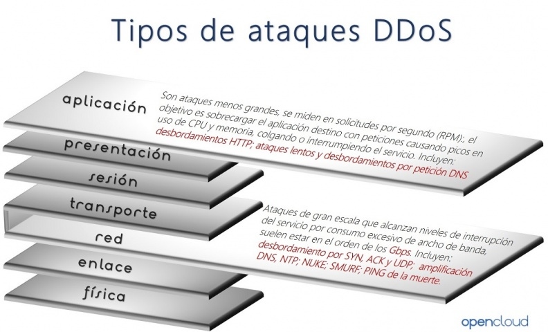
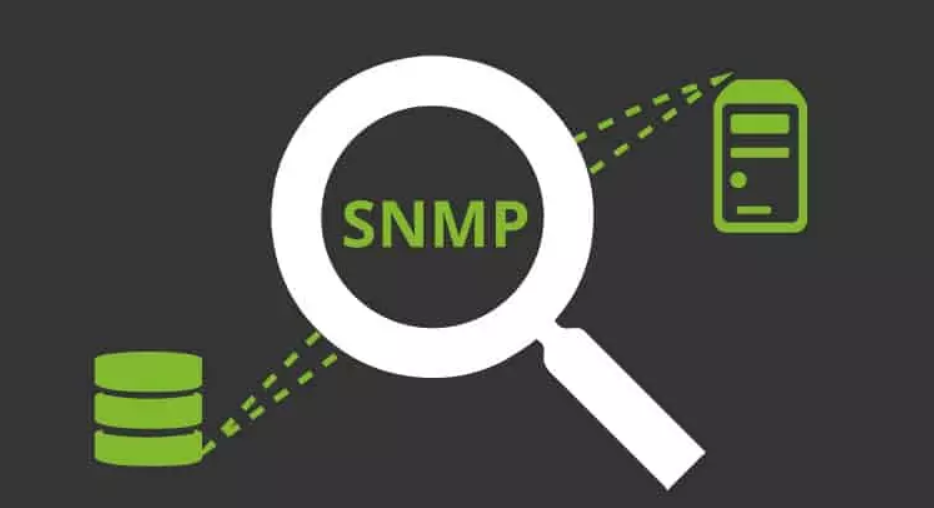

## Seguridad para abrir puertos

Siempre y cuando realizamos aperturas de puertos, es muy recomendable contar con algún sistema  de seguridad que sea capaz de analizar el tráfico que fluye por estos en tiempo real. Los ataques a los que nos exponemos al abrir puertos, pueden ser muy peligrosos al proporcionar malware, accesos no autorizados, y ataques DDoS que causan denegaciones de servicio.

Antes de abrir un puerto, debemos estar seguros que realmente es necesario abrirlo para el correcto funcionamiento de alguna aplicación o servicio. Por la contra, **si estos no son necesarios, lo más recomendable es dejarlos cerrados, de forma que nada se pueda colar por ellos y generar algún tipo de problema como el robo de información**, o una infección del dispositivo.

Por tanto, como has podido ver son varias las circunstancias en las que vas a tener que **abrir los puertos** del router. Esto permitirá que **tu conexión funcione mejor, con más velocidad y evitar ciertos problemas que puedan afectarte a la hora de jugar, descargar o comunicarte a través de aplicaciones**. Ahora bien, si realmente no necesitas tener los puertos abiertos lo ideal, **por seguridad, es que permanezcan cerrados**. Abre únicamente aquellos que sí que vas a necesitar que estén abiertos y así evitarás riesgos innecesarios que puedan afectar a tu seguridad en la red.

 
## Por qué algunos puertos TCP y UDP son peligrosos

En la capa de transporte del modelo TCP/IP, disponemos de dos tipos de protocolos: TCP y UDP. Ambos se utilizan constantemente por los diferentes programas y protocolos de la capa de aplicación, como el puerto 80 y 443 para navegar por la web, el puerto 22 para el protocolo SSH, o el popular puerto 1194 para las VPN con OpenVPN. Algunos de estos puertos son bastante peligrosos si no los filtramos correctamente con un firewall, porque podrían realizarnos diferentes tipos de ataques e incluso hackearnos nuestro equipo.



Normalmente cuando abrimos puertos en nuestros routers, es pensando en algún beneficio que estos nos van a dar, bien sea para que alguna aplicación funcione, o mejorar el rendimiento de otra. Pero estos pueden conllevar algunos peligros, los cuales pueden comprometer no solo nuestro equipo, si no todos los dispositivos que se encuentran en la misma red. Si estos puertos se dejan sin supervisión, los ataques a través de estos aumentan considerablemente.

+ **Malware, troyanos y accesos**: Los puertos abiertos facilitan la comunicación con muchos servicios de internet, y entre ellos los maliciosos. Malware y troyanos son los que más aprovechan este tipo de configuraciones para colarse en las redes y ejecutar servicios no autorizados en los puertos. Algunos de ellos, solo se pueden detectar realizando escaneos muy detallados del sistema. Entre otras cosas, puede quedar expuesta información sensible, robos de credenciales, o que nuestro equipo se pueda manejar de forma remota por un atacante.
+ **Exposición de vulnerabilidades**: Las herramientas de análisis de redes entran aquí en juego, pues los atacantes las utilizan para crear listados de los puertos abiertos. Luego pueden comunicarse con los servicios que escuchan en los puertos abiertos para encontrar información de nuestro equipo. Todo esto, puede servir para posteriores ataques.
+ **Ataques DDoS**: Los puertos abiertos facilitan la transferencia de paquetes para toda aquella entidad que use alguno de los puertos. Si una de ellas establece comunicación, ninguna otra podrá usar ese puertos en ese momento, lo cual puede generar ataques de denegación de servicio, lo cual haría que no sea accesible.

 
## Puertos de servidores más hackeados

Como sabemos, los servidores son elementales para las conexiones de Internet. Son imprescindibles para juegos, comunicaciones, correo electrónico, páginas web en general. Son muchos los puertos que hay en la red y que permiten acceder a estos servidores, así como al contenido en general. Hay miles de puertos y muchos de ellos tienen funciones concretas. Algunos pueden estar abiertos para que alguna determinada herramienta funcione. En este artículo vamos a ver cuáles son los **puertos que suelen ser hackeados** más frecuentemente.

Hay determinados protocolos que utilizan un puerto generalmente. Algunos servidores están diseñados para transferir archivos, otros acceder a equipos remotos, intercambiar mensajes, jugar por Internet. Como decimos, hay muchos puertos que están presentes en la red. Hay determinados protocolos que normalmente utilizan uno en concreto. Vamos a ver cuáles son los más atacados, poniéndolos en orden.

+ **FTP-21**: sin duda uno de los puertos más populares es el 21. Es el que corresponde al protocolo FTP. Permite la transferencia de archivos entre diferentes equipos que estén conectados a una red TCP. Generalmente este protocolo utiliza el puerto 21. Es utilizado para autenticarse en un servidor de forma remota. Los piratas informáticos, dentro de las opciones donde ponen sus miras, tienen muy en cuenta este puerto concreto.
+ **SSH-22**: otro puerto muy utilizado es el 22 por el protocolo SSH. Está diseñado para controlar y modificar servidores de forma remota a través de la red. Tiene un mecanismo que permite autenticar un usuario y fue creado como un sustituto seguro para Telnet. Hoy en día es uno de los objetivos principales de los ciberdelincuentes. A fin de cuentas, como decimos, ponen sus miras en aquello que es más utilizado y donde por tanto pueden tener más éxito.
+ **Telnet-23**: aunque se trata de un protocolo antiguo, todavía sigue estando muy presente. Los piratas informáticos pueden poner sus miras también en este **puerto 23**. Es una herramienta que permite conectarnos en remoto a otro equipo. Muy útil por ejemplo para llevar a cabo una reparación a distancia. Como decimos, es un protocolo antiguo y ha quedado algo en desuso. Precisamente SSH llegó para mejorar la seguridad.
+ **SMTP-25**: SMTP viene de **Simple Mail Transfer Protocol**. Sirve para el intercambio de mensajes a través del correo electrónico entre diferentes dispositivos conectados a la red. Por ejemplo podemos mandar un mensaje de un ordenador a un móvil o viceversa. Generalmente utiliza el puerto 25 del router y es, una vez más, uno de los más atacados por los ciberdelincuentes.
+ **HTTP-80**: es otro protocolo básico en la red. HTTP es el que nos permite transferir información en la web. Indispensable para navegar por Internet y que las páginas nos muestren el contenido correctamente. Por defecto el puerto que suelen utilizar es el 80 y se une así a la lista de los más atacados.
+ **HTTPS-443**: el **protocolo HTTPS** llegó para hacer que las conexiones fueran más seguras. Consiste básicamente en añadir un cifrado al protocolo HTTP. De esta forma, cuando navegamos por una página web que use este protocolo nuestros datos estarían protegidos, sin que pudieran ser expuestos para que posibles intrusos los roben. Utiliza de serie el puerto 443 y también es otro de los que suelen atacar con más frecuencia los piratas informáticos en la red.
+ **POP3-110**: el último puerto que queremos mostrar en esta lista de los más hackeados es el 110, que corresponde generalmente al protocolo POP3. Es el que utilizan los clientes locales de correo electrónico para obtener los mensajes que se almacenan en un servidor remoto.

En definitiva, estos son los puertos de servidores más hackeados. Como vemos son algunos de los más utilizados en el día a día de los usuarios particulares y de empresas. Sirven generalmente para comunicarnos y que nuestros dispositivos puedan acceder a la información de forma remota.

 
## Por qué es muy importante revisar los puertos UDP abiertos

Hay protocolos muy importantes que utilizan los puertos UDP para comunicarse, algunos de estos protocolos son el popular protocolo DNS (Domain Name System) y también el protocolo SNMP (Simple Network Management Protocol). Ambos protocolos utilizan unos puertos DNS por defecto que debemos cerrar si no los estamos utilizando, e incluso deberíamos controlarlos si es que sí estamos usando estos protocolos.

 
### Asegurar el protocolo DNS

Los servidores DNS suelen utilizar el puerto UDP 53, aunque también tenemos la posibilidad de usar otros puertos como el TCP 53, e incluso si hacemos uso de DNS over HTTPS o DNS over TLS, los puertos son diferentes y gobernados por TCP en lugar de UDP. **El puerto 53 UDP es usado ampliamente para recibir las solicitudes DNS**, y para responderlas, es fundamental que, si no tenemos un servidor DNS activado, bloqueemos a través del firewall cualquier tipo de comunicación entrante que utilice este puerto, ya que podríamos estar ante un escaneo de puertos para intentar conseguir información muy valiosa para posteriormente atacar dicho servidor.


En caso de tener configurado el servidor DNS, es muy importante también protegerlo correctamente con el firewall, para evitar los ataques DoS que podrían hacer que el servidor DNS dejase de responder, con los firewalls podríamos limitar el número de peticiones por segundo que podemos recibir, descartando todas las demás, e incluso realizando «baneos» de direcciones IP para que no nos envíen más información.

Una herramienta realmente útil para proteger al servidor DNS de ataques DoS, es [Fail2ban](https://github.com/fail2ban/fail2ban). Esta herramienta nos sirve para analizar el log real del proceso, y en función del log, podrá detectar posibles ataques de denegación de servicio para posteriormente bloquear esas direcciones IP de origen en el firewall. De esta forma, Fail2ban protege al servidor DNS de una manera reactiva, en cuanto detecta un tráfico más alto de lo «normal», automáticamente le dirá al firewall que bloquee cualquier solicitud desde una determinada IP de origen, dejando al servidor DNS disponible para el resto de equipos.

 
### DHCP también utiliza el protocolo UDP, hay que protegerlo

Otro protocolo ampliamente utilizado es el popular protocolo **DHCP (Dynamic Host Control Protocol)**, un protocolo que nos proporciona de manera dinámica y automática las direcciones IP privadas en nuestra red local. Este protocolo hace uso de los **puertos UDP 67/68** para la recepción y el envío de información. Un posible atacante podría enviarnos continuamente DHCP Discover con el fin de saturar el servidor DHCP, o directamente escanear la red en busca del servidor DHCP para saber qué versión del proceso estamos utilizando y si existe alguna vulnerabilidad conocida para posteriormente explotarla.

Como recomendación, si no vamos a usar el servidor DHCP, lo mejor es deshabilitar el proceso, y si lo utilizamos, debemos asegurarnos de que usamos la última versión disponible siempre y que se encuentra libre de vulnerabilidades.

 
### Cómo proteger el protocolo SNMP y evitar ataques

Otro protocolo ampliamente utilizado en redes es el **protocolo SNMP**. Este protocolo SNMP se encuentra en la **capa de aplicación** y permite el intercambio de información de administración entre dispositivos de red, además, el **protocolo SNMP no solamente está en los PC, sino también en casi cualquier dispositivo de red** como routers, switches gestionables, servidores, impresoras, módems e incluso en teléfonos VoIP. Gracias a este protocolo, los administradores de redes podrán monitorizar si existe algún tipo de problema, utilizando sistemas de monitorización como Nagios, Icinga2, Zabbix entre otros muchos que existen, y **no solamente permite ver la configuración y monitorizar el estado de toda la red, sino que también permite realizar configuraciones de manera remota**.

Por la propia naturaleza del SNMP, es muy probable que este proceso esté funcionando con permisos de administrador en un servidor, PC o en tu router, ya que, si SNMP permite que se cambie la configuración de un host, es obligatorio que tenga permisos para ello. Actualmente existen dos versiones de SNMP ampliamente utilizas, la SNMPv2c que la podemos encontrar en la mayoría de dispositivos como routers, switches gestionables, módems y telefonía VoIP, y también la versión SNMPv3 que la encontramos en estos mismos dispositivos siempre que su firmware lo soporte. El protocolo SNMPv3 añade una gran cantidad de medidas de seguridad, incorpora autenticación con cifrado de los datos, y todas las comunicaciones van cifradas punto a punto para garantizar la confidencialidad, anteriormente con el protocolo SNMPv2c todo el tráfico de datos se realiza en texto claro.



Lo primero que tenemos que tener en cuenta para proteger adecuadamente SNMP, es que, **si no lo vamos a utilizar, lo mejor que podemos hacer es deshabilitar el proceso, otra opción es la de bloquear los puertos correspondientes de UDP 161 y UDP 162 por completo en el firewall**. Con estas dos acciones, evitaremos que cualquier tipo de vulnerabilidad que se encuentre en el servicio SNMP pueda ser explotada, ya que lo primero que hará un atacante es realizar un escaneo de puertos y comprobar si el servicio SNMP se encuentra activo. Además, no debemos olvidar que, aunque el SNMP esté en modo de solo lectura, es posible recibir un ataque de denegación de servicio si no está bien implementado este protocolo, tal y como ocurrió en el sistema operativo Cisco IOS hace años.

Otra medida de seguridad que podemos tomar, es la de solamente responder a las direcciones IP que nosotros definamos, no obstante, UDP es un protocolo no orientado a conexión, por lo que realizar un IP spoofing es realmente sencillo, así que esta opción es un añadido más y no una solución completa a tomar. Si haces uso de SNMPv3, estarás protegido frente a este posible ataque.

A nivel de firewall, si haces uso de iptables u otros firewalls, podemos crear un par de reglas para limitar el acceso al servidor SNMP de nuestro equipo, y también limitar la salida de información a otra dirección IP.

```shell
$ iptables -A INPUT -s <direccion ip> -p udp -m udp --dport 161 -j ACCEPT
$ iptables -A OUTPUT -d <direccion ip> -p udp -m udp --sport 161 -j ACCEPT
```
 

Por supuesto, en el caso de usar versiones inferiores a SNMPv3, todas las comunicaciones van sin cifrar, aunque sí tenemos autenticación para la lectura y escritura en los diferentes hosts, por este motivo, es muy recomendable no tener accesible a la red de gestión cualquier equipo, ya que podría realizar un ataque Man in the Middle y capturar las credenciales de acceso RW de SNMP. Segmentar adecuadamente la red en VLANs es algo fundamental y que no debemos dejar de lado en el diseño y securización de la red. Con el protocolo SNMPv3 tendremos una buena autenticación y cifrado con criptografía, pero es susceptible a ataques de fuerza bruta o de diccionario para adivinar las claves de autenticación, sobre todo si estas claves son cortas en longitud, por lo que es recomendable usar claves largas. Por último, una muy buena recomendación de seguridad es hacer uso de SNMP dentro de un túnel SSH o directamente dentro de un túnel VPN, siempre que esto sea posible, claro.

El mismo programa *Fail2ban* que os hemos recomendado anteriormente, también es capaz de proteger correctamente el protocolo SNMP frente a posibles ataques DoS que realice un atacante en la red.